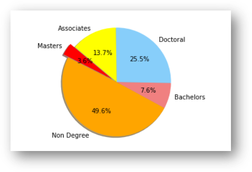
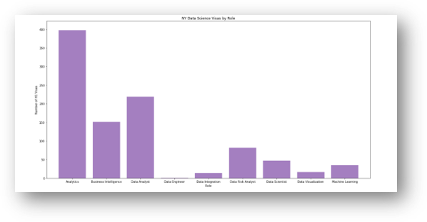
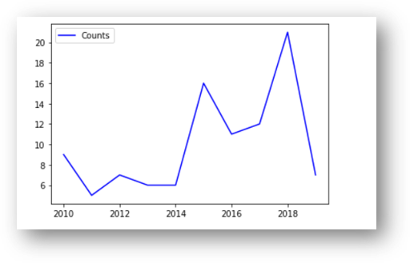

# blockchain-brigade
Blockchain Brigade is a Data Analytics team that tracks the demand for Post Secondary education services being requested by the public.

## Overview
**Data Science Bootcamp vs Traditional Data Science Degree**   
In today’s job market it is imperative for you to ensure your credentials are marketable and can appeal to multiple industries.  Technology is continuously evolving, and you may have noticed an increased trend in Data Science Bootcamps being offered.    
In this project we will develop a data analysis to determine the educational and financial benefit of obtaining data science credentials from completing a bootcamp vs getting a traditional data science degree.

## Project Team / Organization
<table>
  <th>Name</th>
  <th>Title</th>
  <tr>
    <td>Amber Martin</td>
    <td>Project Manager</td>
  </tr>
  <tr>
    <td>Karl Ramsay</td>
    <td>Repository Manager</td>
  </tr>
   <tr>
    <td>Oswaldo Moreno</td>
    <td>Scrum Master</td>
  </tr>
  <tr>
    <td>Ana Razak</td>
    <td>Programmer Analyst</td>
  </tr>
  <tr>
    <td>Anthony Brown</td>
    <td>Programmer Analyst</td>
  </tr>
</table>

## Project Overview
SCOPE:  
To complete a full data analysis of API data and CSV files to determine job availability, education level and salary potential of completing a Data Science boot camp.   
OBJECTIVE:  
- To understand the career benefit of completing Data Science boot camp
- Utilize the data results to make an educated decision on career path
- Gain an understanding of how completion of a Data Science boot camp compares to a traditional Data Science degree in today’s job market
- Project the financial benefit of salary increase potential 

## Let's Go to the Analysis
We wanted to determine the education level of people who enroll in Data Science programs.   
- Utilizing StockOver 2019 survey data, we imported the data file into Jupyter Notebook with a pd.read function. By creating a data frame and then cleaning the data within the frame created; with the use of functions like .replace, .groupby and .append , we were able identify the education levels within scope.  
- Based on the results of the analysis 49.6% of the survey participants who completed a Data Science Bootcamp do not have a traditional data science degree. With data science credentials trending a such a fast pace in today’s market people are choosing to complete a bootcamp in order to remain marketable.

  

Additionally we wanted to look at how many people with visas are working in the data science field to see how high the demand for people in the data science field is.  
- Using a VBA script, we prepped the csv file by creating two new columns called Role and Domain to filter out job titles using key word Data Science.. Then created a few groupby’s to get specific states we wanted to look at. 
- Then we wanted to look at the comparison in salaries for each job title. So made a bar graph comparing job titles to salaries and another bar graph comparing the number of H1B1 visas to job titles.  

  

  

---
Using the NY times API we wanted to see the past and current movement of increase data science popularity through a time series data analysis. Which involves the comparison of data over a specific period of time to spot a pattern or trend.  

- The NYT API key was used to pull raw data from the NYT server. Once we received the API key, with the 'machine + learning' query searched for articles within a 10-year time frame (Jan 2010- December of 2019). The returned articles from the search were appended into a lists. 
- Usina combination of functions from the Pandas and Matplotlib libraries to extract and visualize time series charts to examine the increasing buzz around machine learning over the course of the past ten (10) years.  

An important thing to note as well, given the New York Times is a main stream print and online publication (as opposed to a specialized IT guild publication), for the data science domain to to be featured almost twice a month at this peak, speaks volumes of it impact across all domains and genres of life. It's multi-domain impact is reflected in the variety of News Desk section under which the Machine Learning concept has appeared.

  

  

